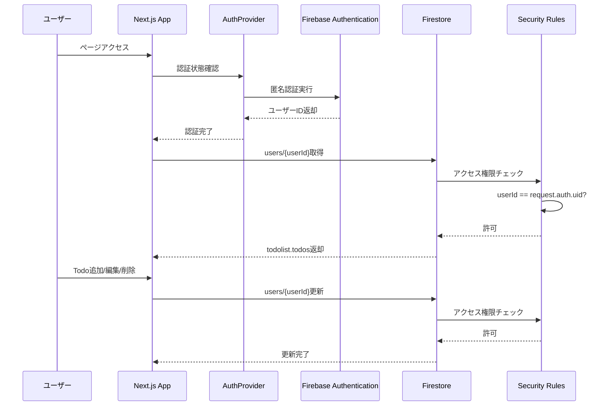

# このプロジェクトについて
ポートフォリオとして作成したリポジトリです。
cursorを利用して、短期間でTODOアプリを作成します。

# 利用技術
Next.js + typescript + Firebaseで作成します。

# デプロイ先
https://todo-list-backend--todo-list-e8a5c.asia-east1.hosted.app/

# Firebaseとの関係

## アーキテクチャ図

### 認証とデータアクセスの流れ



### データ保存構造

```
Firestore
│
└── users (コレクション)
    │
    └── {userId} (ドキュメントID = 匿名認証のUID)
        │
        ├── todolist (オブジェクト)
        │   └── todos (配列)
        │       ├── [0]
        │       │   ├── id: "1234567890"
        │       │   ├── text: "Todoのテキスト"
        │       │   ├── completed: false
        │       │   └── createdAt: Timestamp
        │       ├── [1]
        │       │   ├── id: "0987654321"
        │       │   ├── text: "別のTodo"
        │       │   ├── completed: true
        │       │   └── createdAt: Timestamp
        │       └── ...
        │
        └── expireAt (Timestamp)
            └── 作成日から7日後の日時
```

## データ構造

```
Firestore
└── users/
    └── {userId}/  (ユーザーID = 匿名認証のUID)
        ├── todolist: {
        │     todos: [
        │       {
        │         id: string,
        │         text: string,
        │         completed: boolean,
        │         createdAt: Timestamp
        │       },
        │       ...
        │     ]
        │   }
        └── expireAt: Timestamp  (作成日から7日後)
```

## 認証フロー

1. **ページアクセス時**
   - `AuthProvider`が自動的に匿名認証を実行
   - 認証成功後、ユーザーID（UID）を取得

2. **データ取得**
   - 認証完了後、`users/{userId}`ドキュメントから`todolist.todos`を取得
   - ドキュメントが存在しない場合は、空の配列と`expireAt`（7日後）で初期化

3. **データ操作**
   - Todoの追加・編集・削除・完了状態の変更はすべて`users/{userId}`ドキュメントを更新
   - セキュリティルールにより、自分の`userId`のドキュメントのみアクセス可能

## セキュリティルール

- `users/{userId}/{document=**}` パスに対して、`userId`と`request.auth.uid`が一致する場合のみ読み書きを許可
- その他のコレクションはすべて拒否
