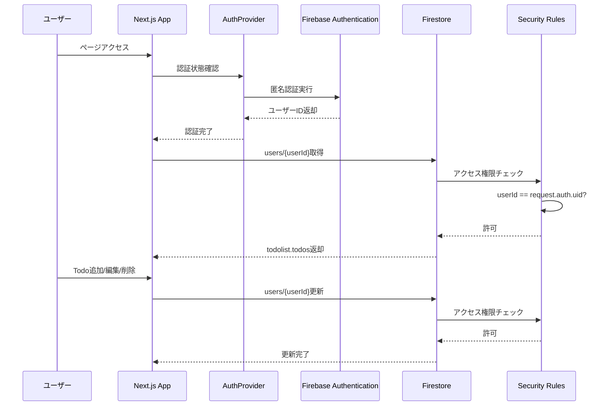

# 利用技術
Next.js + typescript + Firebaseで作成します。

# デプロイ先
https://todo-list-backend--todo-list-e8a5c.asia-east1.hosted.app/

# Firebaseとの関係

## アーキテクチャ図

### 認証とデータアクセスの流れ


```mermaid
sequenceDiagram
    participant User as ユーザー
    participant App as Next.js App
    participant Auth as AuthProvider
    participant FirebaseAuth as Firebase Authentication
    participant Firestore as Firestore
    participant Rules as Security Rules

    User->>App: ページアクセス
    App->>Auth: 認証状態確認
    Auth->>FirebaseAuth: 匿名認証実行
    FirebaseAuth-->>Auth: ユーザーID返却
    Auth-->>App: 認証完了
    
    App->>Firestore: users/{userId}取得
    Firestore->>Rules: アクセス権限チェック
    Rules->>Rules: userId == request.auth.uid?
    Rules-->>Firestore: 許可
    Firestore-->>App: todolist.todos返却
    
    User->>App: Todo追加/編集/削除
    App->>Firestore: users/{userId}更新
    Firestore->>Rules: アクセス権限チェック
    Rules-->>Firestore: 許可
    Firestore-->>App: 更新完了
```

### データ保存構造

```
Firestore
│
└── users (コレクション)
    │
    └── {userId} (ドキュメントID = 認証のUID)
        │
        ├── todolist (オブジェクト)
        │   └── todos (配列)
        │       ├── [0]
        │       │   ├── id: "1234567890"
        │       │   ├── text: "Todoのテキスト"
        │       │   ├── completed: false
        │       │   └── createdAt: Timestamp
        │       ├── [1]
        │       │   ├── id: "0987654321"
        │       │   ├── text: "別のTodo"
        │       │   ├── completed: true
        │       │   └── createdAt: Timestamp
        │       └── ...
        │
        └── expireAt (Timestamp, 匿名ユーザーのみ)
            └── 作成日から7日後（Firestore TTLで自動削除）
```

## データ構造

```
Firestore
└── users/
    └── {userId}/  (ユーザーID = 認証のUID)
        ├── todolist: {
        │     todos: [
        │       {
        │         id: string,
        │         text: string,
        │         completed: boolean,
        │         createdAt: Timestamp
        │       },
        │       ...
        │     ]
        │   }
        └── expireAt: Timestamp  (匿名ユーザーのみ、作成日から7日後)
```

## 認証フロー

1. **ページアクセス時**
   - `AuthProvider`が自動的に匿名認証を実行
   - 認証成功後、ユーザーID（UID）を取得

2. **データ取得**
   - 認証完了後、`users/{userId}`ドキュメントから`todolist.todos`を取得
   - ドキュメントが存在しない場合は空の配列で初期化。匿名ユーザーの場合のみ、作成日から7日後の`expireAt`をセット（Firestore TTLで自動削除対象）

3. **データ操作**
   - Todoの追加・編集・削除・完了状態の変更はすべて`users/{userId}`ドキュメントを更新
   - セキュリティルールにより、自分の`userId`のドキュメントのみアクセス可能

## セキュリティルール

- `users/{userId}/{document=**}` パスに対して、`userId`と`request.auth.uid`が一致する場合のみ読み書きを許可
- その他のコレクションはすべて拒否

# 期日（dueDate）の仕様

## 期日の入力方法

タスク追加・編集時のテキストにスペース区切りで日付キーワードを含めると、自動的に期日として解釈されます。

```
例: 報告書作成 来週金曜日
 → テキスト「報告書作成」、期日「来週金曜日」
```

### 対応キーワード一覧

| キーワード例 | 意味 |
|---|---|
| `今日` | 当日 |
| `明日` | 翌日 |
| `明後日` | 2日後 |
| `月曜` / `月曜日` | 今週または来週の月曜（今日以降で直近） |
| `火曜` 〜 `日曜`（`〜日` も可） | 同上・各曜日 |
| `来週月曜` / `来週月曜日` | 来週の月曜（今週の月曜を起点に +7日） |
| `来週火曜` 〜 `来週日曜`（`〜日` も可） | 同上・各曜日 |
| `15日` などの日付 | 当月の指定日（過去の場合は翌月） |

## 期日の表示ラベル

| 条件 | 表示 |
|---|---|
| 当日 | `今日` |
| 1日後 | `明日` |
| 2日後 | `明後日` |
| それ以外 | `M/D(曜)` 形式（例: `4/25(土)`） |

## 期日のステータス（色分け）

| ステータス | 条件 | バッジ色 |
|---|---|---|
| `overdue` | 期日が過去 | 赤 |
| `today` | 当日 | オレンジ |
| `soon` | 翌日〜2日後 | 黄 |
| `future` | 3日以上先 | グレー |

## 「今日やること」ビュー

カンバンボードの左端に、全グループ・インボックスを横断して `today` / `overdue` の未完了タスクを集約表示します。タスクの実データは各グループ列に残ったままで、このビューはあくまで参照用です。
